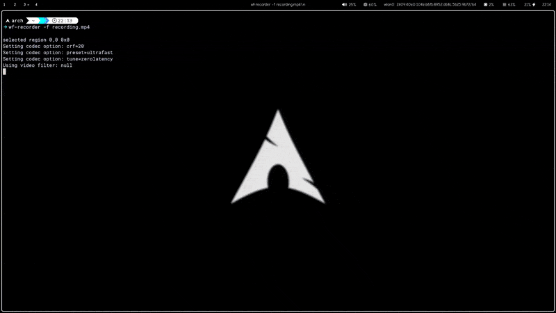
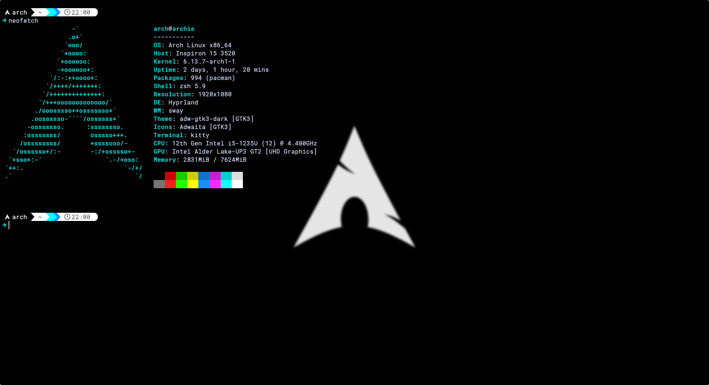
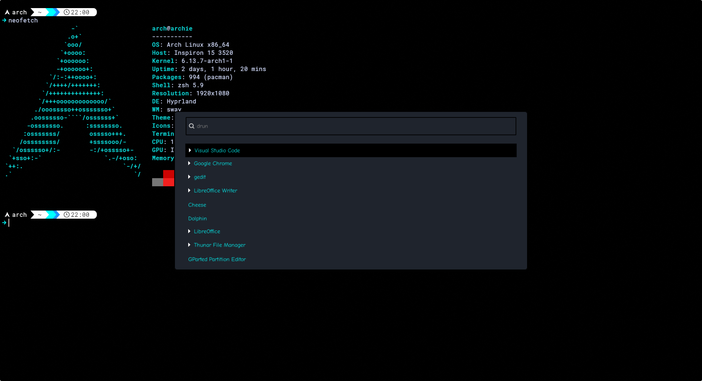

# My Arch Linux Hyprland Setup

Welcome to my Arch Linux setup, with Hypr Ecosystem and Waybar

And yes, I use Arch BTW. 😎

This repository contains all my personal configuration files (dotfiles) It’s lightweight, efficient, and perfect for minimalistic setup lovers—or newbies brave enough to dive into the Arch deep end. 

---

## Features

- **Minimalistic Design:** No bloat, just a clean and simple interface.
- **Wallpapers:** `hyprpaper` keeps your desktop looking sharp with custom wallpapers.  
  Check out a quick walkthrough of the setup:  
<!-- https://youtu.be/_BAXw6tV4kQ -->
[](https://youtu.be/_BAXw6tV4kQ)


- **Terminal Emulator:** `kitty` delivers a fast, GPU-accelerated terminal experience.
- **Prompt:** `starship` gives you a blazing-fast, customizable shell prompt.

- **Status Bar:** `waybar` shows system info like time, battery, and network.
  
- **Menu Launcher:** `wofi` offers a lightweight, Wayland-friendly app launcher.
  
- **Screenshot Feature:** Capture windows or regions effortlessly with `hyprshot`.
- **Lockscreen:** Secure your system with `hyprlock`, showing the password field only when you type.
- **Idle Management:** `hypridle` locks your screen after inactivity.
---
## Prerequisites

Before installing, ensure you have the following. Don’t worry, it’s not as scary as it sounds (unless you’re terrified of penguins):
- **Arch Linux (or derivative):**  
    You’re on Arch, right? If not, this is your golden ticket to the "I use Arch, BTW" club. Derivatives like EndeavourOS or Manjaro are fine too, but real Arch users might judge you quietly.

- **sudo privileges:**  
You’ll need to wield root powers. No sudo? Time to set it up—unless you love typing su like it’s 1999.
- **A working Wayland session:**  
     Hyprland runs on Wayland, so X11 won’t cut it. Join the future, or at least fake it ‘til you make it.

- **AUR helper (optional):**  
     An AUR helper like yay or paru is your best friend for fonts and extras. Install one with:
    ```sh
    sudo pacman -S yay  # or paru
    ```
    It’s like having a butler for the Arch User Repository—who has time to build packages by hand?

Check these off, and you’re golden. Otherwise, there’s always Windows… just kidding, you’ve got this! 😜

---

## Installation

### 1. Clone the Repository

```sh
git clone https://github.com/AnubhabMukherjee2003/My-ARCH-hyprland-setup.git ~/.config/my-hyprland-setup
cd ~/.config/my-hyprland-setup
```

### 2. Install Required Packages

```sh
sudo pacman -S hyprland hyprshot hyprlock hypridle hyprpaper swaync waybar kitty wofi starship git
```

For AUR fonts:

```sh
sudo pacman -S yay  # or paru
```

### 3. Symlink Configurations (using stow)

```sh
sudo pacman -S stow
stow --target=$HOME zshrc
stow --target=$HOME/.config hypr kitty waybar wofi starship
```

Or copy manually:

```sh
cp .bashrc ~/
cp .zshrc ~/
cp -r .config/* ~/.config/
```

### 4. Install Fonts

```sh
yay -S ttf-roboto-mono-nerd ttf-comic-neue
fc-cache -fv
```

### 5. Reload and Restart Services

```sh
hyprctl reload
pkill waybar && waybar &
```

`starship` will activate in new shell sessions.

---

## What Each Package Does

- **hyprland:** Dynamic Wayland window manager.
- **hyprshot:** Screenshot utility for Hyprland.
- **hyprlock:** Lockscreen tool for Hyprland.
- **hypridle:** Idle state manager for auto-locking.
- **hyprpaper:** Wallpaper manager for Hyprland.
- **swaync:** Notification center for Wayland.
- **waybar:** Customizable status bar.
- **kitty:** Fast, GPU-based terminal emulator.
- **wofi:** Minimalist Wayland launcher/menu.
- **starship:** Cross-shell, fast, customizable prompt.
- **git:** Version control for managing dotfiles.
---

## Where Config Files Go

- **Shell:**  
  `~/.bashrc` – Bash prompt  
  or
  `~/.zshrc` – Zsh prompt

- **Starship Prompt:**  
  `~/.config/starship.toml`

- **Hyprland:**  
  `~/.config/hypr/hyprland.conf`  
  `~/.config/hypr/hyprlock.conf`  
  `~/.config/hypr/hypridle.conf`  
  `~/.config/hypr/hyprpaper.conf`

- **Kitty:**  
  `~/.config/kitty/kitty.conf`  
  `~/.config/kitty/current-theme.conf`

- **Waybar:**  
  `~/.config/waybar/config`  
  `~/.config/waybar/style.css`

- **Wofi:**  
  `~/.config/wofi/style.css`

---

## Usage

- **Launcher:**  
  `Super + d` to open wofi and launch apps.  
  `waybar` starts automatically.

- **Lockscreen:**  
  `Super + Shift + L` or run `hyprlock`.

- **Screenshots:**  
  `Print` for window shots, `Shift + Print` for regions via hyprshot.

- **Idle:**  
  `hypridle` locks the screen after 10 minutes (configurable).

---

## Customization & Contributing

Love tweaking? Fork this repo and adjust colors, keybinds, or fonts as you like.  
Pull Requests are welcome!  
**Note:** Never commit passwords or API keys—use placeholders.

---

## Troubleshooting & References

- [Arch Wiki](https://wiki.archlinux.org/)
- [Hyprland Wiki](https://wiki.hyprland.org/)
- [Waybar GitHub](https://github.com/Alexays/Waybar)

Still stuck? Open an issue here.  
Enjoy your minimal Arch + Hyprland setup!  
If it breaks, you get to keep both pieces—and brag about using Arch. 😜
